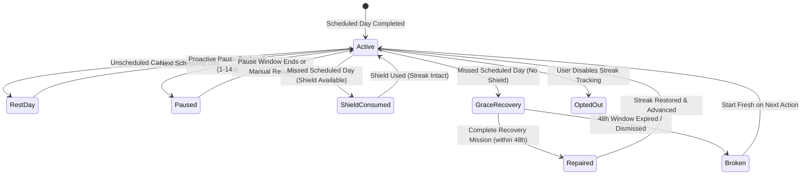

# AXIOM Flexible Streak & Meaningful Recovery Protocol (E4.1)

## Document Control
- **Status:** Canonical
- **Gate:** G5 (Retention Proof)
- **Work Packet:** G5-P1 (E4.1 Flexible Streak & Recovery)
- **Compliance:** Product Constitution §3.5 ("Failure is data, not punishment; no rank drop, HP loss, or shame copy")
- **Target Metric:** Streak Recovery Rate $\ge 40\%$

---

## 1. Core Philosophy: Dignity Over Coercion
Traditional streaks rely on loss aversion and punitive psychology, leading to acute demoralization when inevitable life events (illness, travel, urgent commitments) break a rigid daily chain. Under Product Constitution §3.5, AXIOM strictly rejects shame-based gamification:
1. **Capabilities Built Are Permanent:** A missed day does not erase neurological adaptions, physical conditioning, or completed real-world work.
2. **Failure is Data, Not Guilt:** Language like *"SYSTEM BREACH"*, *"STREAK BROKEN"*, *"DAYS LOST"*, or *"PENALTY"* is replaced with constructive framing (*"Cadence Interrupted"*, *"Rhythm Paused"*, *"Recovery Mission"*).
3. **No Pay-to-Recover:** Streaks cannot be purchased back with cash, subscriptions, or vanity currency. Restoration requires genuine, real-world micro-effort.

---

## 2. Streak State Machine & Evaluation Hierarchy

### Evaluation Hierarchy
1. **Opt-Out Check:** If `streak_tracking_enabled == false`, streak evaluation immediately yields `OptedOut`. All streak badges, counters, and milestone overlays are suppressed without nagging.
2. **Proactive Pause:** If user declared a planned pause (1 to 14 days maximum), streak evaluation yields `Paused`. The streak is preserved with zero decay.
3. **Scheduled Cadence Evaluation:**
   - Cadence options: `EVERYDAY` (7 days), `WEEKDAYS_ONLY` (Mon–Fri), `CUSTOM` (explicit `DayOfWeek` set).
   - If yesterday was an unscheduled rest day, the streak is NOT broken. Evaluation yields `RestDay` or `Active`.
4. **First Defense — Reactive Freeze Shield:** If a scheduled day was missed and a shield is available, the shield is consumed and the streak survives untouched.
5. **Second Defense — 48-Hour Grace Recovery:**
   - If no shield is available, the streak enters `GraceRecovery` rather than instant annihilation.
   - The user has 48 hours to complete a real-world recovery mission.
   - If completed within grace, the streak is repaired (`frozenStreak + 1`) and the recovery is logged.
   - Anti-predatory cooldown: recovery can be utilized at most once every 14 days to prevent continuous avoidance.
6. **Grace Expiration:** If 48 hours lapse without a recovery action, the streak resets cleanly to 0 without penalty copy, ready to restart at 1 upon next completion.

---

## 3. Real-World Recovery Missions
Recovery missions require meaningful effort aligned with real goals:
1. **Momentum Re-anchor (Core Goal Action):** Execute one concrete micro-action advancing an active primary Goal (+15 XP).
2. **Deep Focus Re-calibration (15-min Session):** Complete an uninterrupted 15-minute deep focus cycle (+15 XP).
3. **Reflection & Alignment (Log Lesson & Intention):** Record what interrupted the cadence and establish one constructive boundary (+10 XP).

---

## 4. Telemetry & Retention Privacy Guardrails
All streak lifecycle events conform strictly to `AnalyticsPayloadPolicy` (zero PII, zero Goal titles or free text):
- `streak_paused` (`days_paused`, `resume_date`, `cohort_ring`)
- `streak_resumed` (`reason`, `cohort_ring`)
- `streak_recovery_offered` (`streak_length`, `cadence`, `cohort_ring`)
- `streak_recovery_completed` (`streak_length`, `recovery_mission_id`, `cohort_ring`)
- `streak_recovery_expired` (`streak_length`, `cohort_ring`)
- `streak_opt_out_changed` (`opt_out_state`, `cohort_ring`)

### Recovery Metric Target
$$\text{Streak Recovery Rate} = \frac{\sum \text{streak\_recovery\_completed}}{\sum \text{streak\_recovery\_offered}} \ge 40\%$$
